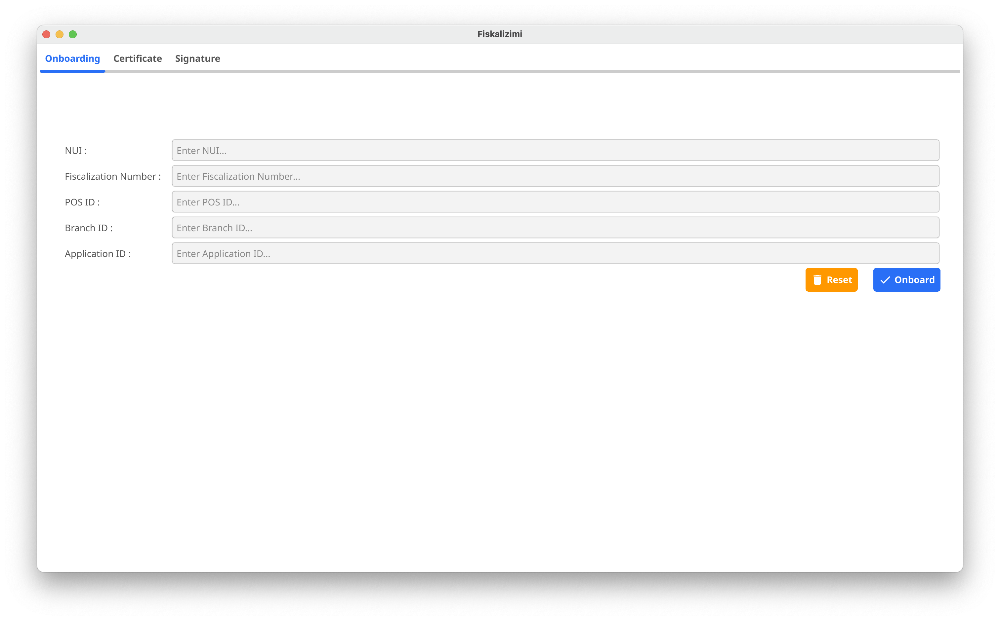

# Fiscalization Integration with Golang using Protobuf

This repository provides a Golang implementation for integrating with a fiscalization system using classes generated by Protobuf. The process includes constructing fiscal receipts (Citizen and POS Coupons), digitally signing them, and submitting them to the fiscalization service. This guide walks you through the steps necessary to integrate and execute the solution.

## Table of Contents

- [Project Overview](#project-overview)
- [Getting Started](#getting-started)
    - [Prerequisites](#prerequisites)
    - [Installation](#installation)
- [Generating Protobuf Models](#generating-protobuf-models)
- [Model Explanation](#model-explanation)
    - [Citizen Coupon](#citizen-coupon)
    - [POS Coupon](#pos-coupon)
- [PKI Key Generation](#key-generation)
    - [Using Onboarding Tool](#using-onboarding-tool)
    - [Using The API](#using-the-api)
- [Digital Signing](#digital-signing)
    - [Steps to Generate Digital Signature](#steps-to-generate-digital-signature)
    - [QR Code Generation](#qr-code-generation)
- [Sending Data to Fiscalization Service](#sending-data-to-fiscalization-service)
    - [Sending Citizen Coupons](#sending-citizen-coupons)
    - [Sending POS Coupons](#sending-pos-coupons)
- [Running the Application](#running-the-application)

## Project Overview

This project provides a set of Golang functions to interact with a fiscalization system. The key components include:

1. **Models**: The Protobuf-generated models (CitizenCoupon, PosCoupon).
2. **CouponBuilder**: Constructs Citizen and POS coupons (receipts) using predefined tax groups, items, and payment methods.
3. **Signer**: Signs the receipts using a digital signature created with an ECDSA private key.
4. **Fiscalization**: Contains methods for constructing, signing, and sending fiscal coupons to the fiscalization service.

### Key Technologies

- **Protobuf**: Used for serializing data models (CitizenCoupon, PosCoupon) to binary format.
- **ECDSA**: Elliptic curve algorithm used for digital signatures.
- **HTTP**: For sending data to the fiscalization service using Golang’s `net/http` package.

## Getting Started

### Prerequisites

Before integrating the system, ensure you have the following installed:

- [Golang](https://golang.org/dl/)
- [Protobuf Compiler](https://developers.google.com/protocol-buffers)
- A valid [ECDSA private key](#key-generation) for signing the data.

### Installation

1. Clone this repository:
   ```bash
   git clone https://github.com/fiskalizimi/pos-golang.git
   cd pos-golang

## Generating PROTOBUF models ##

To install and start using Protocol Buffers (protobuf) in a Go project, 
begin by installing the Protocol Buffer Compiler (protoc). You can download it 
from the [official release page](https://github.com/protocolbuffers/protobuf/releases), 
ensuring it is added to your system's PATH. Next, install the Go plugin for protoc by running:
```
go install google.golang.org/protobuf/cmd/protoc-gen-go@latest
``` 
and 
```
go install google.golang.org/protobuf/cmd/protoc-gen-go-grpc@latest.
``` 
These plugins generate Go code for protobuf definitions and gRPC services. 
Add the ```$GOPATH/bin``` directory to your PATH to make ```protoc-gen-go``` and ```protoc-gen-go-grpc``` accessible. 
To use protobuf, create a .proto file defining your messages and services, and then generate 
the Go files using the command: 
```
protoc --go_out=. --go-grpc_out=. your_file.proto.
``` 
Finally, integrate the generated code into your Go project, import the appropriate packages, 
and use the defined structs and services in your application.

We have generated the GO code located at [```proto/models.pb.go```](fiskalizimi/proto/models.pb.go)

## Model Explanation ##

### Citizen Coupon ###

The ```CitizenCoupon``` represents a simplified receipt that will be the part of QR Code. Below is the example structure created by the [```GetCitizenCoupon```](fiskalizimi/model_builder.go) function:

```
func GetCitizenCoupon() *proto.CitizenCoupon {
	return &proto.CitizenCoupon{
		BusinessId: 1,
		PosId:      1,
		BranchId:   1,
		CouponId:   1234,
		Type:       proto.CouponType_Sale,
		Time:       time.Date(2024, time.September, 24, 6, 11, 29, 0, time.Local).Unix(),
		Total:      1820,
		TaxGroups: []*proto.TaxGroup{
			{TaxRate: "C", TotalForTax: 450, TotalTax: 0},
			{TaxRate: "D", TotalForTax: 320, TotalTax: 26},
			{TaxRate: "E", TotalForTax: 1050, TotalTax: 189},
		},
		TotalTax: 215,
		TotalNoTax: 1605,
	}
}
```

The Citizen Coupon includes:

* **BusinessID** which is NUI of the business (received from ATK)
* **PosID** is the unique id of the POS. POS is the computer/till that has the POS system installed. Each POS unit must have a unique ID.
* **BranchID** is the unique id of Branch where the POS system is located
* **CouponID** is the unique identifier of the fiscal coupon generated by POS system
* **Type** this is the type of the coupon. It is an enum value and can be ```SALE```, ```RETURN``` or ```CANCEL```
* **Time** the time fiscal coupon is issued. The value is Unix timestamp
* **Total** that represents the total value to be paid by customer
* **TaxGroups** is an array of ```TaxGroup``` objects. Each ```TaxGroup``` object represents the details about tax category
* **TotalTax** is the amount of the tax in total that customer will have to pay
* **TotalNoTax** is the total amount without tax that customer will have to pay

**NOTE:** These details must match the [POS Coupon](#pos-coupon) details, otherwise the coupon will be marked as ```FAILED VERIFICATION``` !

### POS Coupon ###

The PosCoupon includes all details of the POS Coupon that will be printed and given to the customer. [```GetPosCoupon```](fiskalizimi/model_builder.go) returns an instance of the POS Coupon 

```
func GetPosCoupon() *proto.PosCoupon {
	return &proto.PosCoupon{
		BusinessId:     60100,
		PosId:          1,
		CouponId:       10,
		BranchId:       1,
		Location:       "Prishtine",
		OperatorId:     "Kushtrimi",
		ApplicationId:  1234,
		ReferenceNo:    0,
		VerificationNo: "1234567890123456",
		Type:           proto.CouponType_Sale,
		Time:           time.Date(2024, time.September, 24, 6, 11, 29, 0, time.Local).Unix(),
		Items: []*proto.CouponItem{
			{Name: "uje rugove", Price: 150, Unit: "cope", Quantity: 3, Total: 450, TaxRate: "C", Type: "TT"},
			{Name: "sendviq", Price: 300, Unit: "cope", Quantity: 2, Total: 600, TaxRate: "E", Type: "TT"},
			{Name: "buke", Price: 80, Unit: "cope", Quantity: 4, Total: 320, TaxRate: "D", Type: "TT"},
			{Name: "machiato e madhe", Unit: "cope", Price: 150, Quantity: 3, Total: 450, TaxRate: "E", Type: "TT"},
		},
		Payments: []*proto.Payment{
			{Type: proto.PaymentType_Cash, Amount: 500},
			{Type: proto.PaymentType_CreditCard, Amount: 1000},
			{Type: proto.PaymentType_Voucher, Amount: 320},
		},
		Total: 1820,
		TaxGroups: []*proto.TaxGroup{
			{TaxRate: "C", TotalForTax: 450, TotalTax: 0},
			{TaxRate: "D", TotalForTax: 320, TotalTax: 26},
			{TaxRate: "E", TotalForTax: 1050, TotalTax: 189},
		},
		TotalTax:     215,
		TotalNoTax:  1605,
		TotalDiscount: 75,
	}
}

```

The POS Coupon includes:

* **BusinessId** which is NUI of the business (received from ATK)
* **PosId** is the unique id of the POS. POS is the computer/till that has the POS system installed. Each POS unit must have a unique ID.
* **CouponId** is the unique identifier of the fiscal coupon generated by POS system. CouponId has to be unique for Business (across all branches)
* **BranchId** is the unique id of Branch where the POS system is located
* **Location** is the location/city of the Sale Point
* **OperatorId** is the ID/Name of the operator/server
* **ApplicationId** is the unique ID of the Application/POS System used. This code is provided by the Software provider that has implemented the POS Solution.
* **ReferenceNo** is the number of the original coupon when there is a return or cancellation of a coupon. Otherwise the field is value should be 0.
* **VerificationNo** is a unique value for each coupon and it is 16 characters long max. Verification Number is used to check if the Coupon has been verified by the citizen.
* **Type** this is the type of the coupon. It is an enum value and can be ```SALE```, ```RETURN``` or ```CANCEL```
* **Time** the time fiscal coupon is issued. The value is Unix timestamp
* **Items** is an array of ```CouponItem``` objects. Each ```CouponItem``` represents an item sold to the customer.
* **Payments** is an array of ```Payment``` that represent the types of the payment methods and the amoun used by customer to pay for the goods. The valid types are: ```Cash```, ```CreditCard```, ```Voucher```, ```Cheque```, ```CryptoCurrency```, and ```Other```.
* **Total** that represents the total value to be paid by customer
* **TaxGroups** is an array of ```TaxGroup``` objects. Each ```TaxGroup``` object represents the details about tax category
* **TotalTax** is the amount of the tax in total that customer will have to pay
* **TotalNoTax** is the total amount without tax that customer will have to pay
* **TotalDiscount** is the total amount of discount the customer received for this transaction 

Upon receiving the POS Coupon, Fiscalisation Service will return a uniques uint64 value called ```TransactionNo```. The response will be a JSON:

```
{
    "message" : "string"    // The message
    "transaction_id: "uint64"  // The unique Transaction ID for this coupon
}
```

**NOTE:** These details must match the [Citizen Coupon](#citizen-coupon) details, otherwise the coupon will be marked as ```FAILED VERIFICATION``` !

## Key Generation ##

There are different ways to generate a PKI key pair, depending on the operating system.

**WARNING!** Each POS system (PC/till) needs to have a unique ID and its own PKI key pair. The private key should never leave the machine that it is generated on !!!

To onboard your business, you need the following information:

1. NUI of the business
2. Fiscalization Number - (this is obtained from EDI)
3. Pos ID - each POS should have a unique ID which is a numeric value
4. Branch ID
5. Application ID - obtained from the ATK upon certifying the POS Application

### Using Onboarding Tool ###

We have provided a tool that simplifies the process a lot by creating the key pair, generating a CSR and sending the CSR to ATK Certificate Authority to be digitally signed and verified.

If you have cloned this repository the tool for different operating systems is located under the folder ```onbarding``` or, alternatively to download the tool on you machine, click on one of the links below (depending on the operating system you are using):

* [onboarder for windows](https://github.com/fiskalizimi/pos-golang/raw/refs/heads/main/onboarder/onboarder-windows.zip)
* [onboarder for MacOS](https://github.com/fiskalizimi/pos-golang/raw/refs/heads/main/onboarder/onboarder-macos.zip)
* [onboarder for Linux](https://github.com/fiskalizimi/pos-golang/raw/refs/heads/main/onboarder/onboarder-linux.zip)

To onboard your business, you need the following information:

1. NUI of the business
2. Fiscalization Number - (this is obtained from EDI)
3. Pos ID - each POS should have a unique ID which is a numeric value
4. Branch ID

Once you have downloaded the onboarder tool, and extracted/unzipped it to a folder, then you need to run the application. 
You need to provide an environment flag as an argument to the executable. For testing purposes the environment value should be ```TEST```, and for production the environment value should be ```PROD```

For example

On Windows Platform you need to open a command prompt then execute the application like the example below:
```shell
onboarder.exe -env=TEST
```

On linux/macos you need to open a terminal and then exeucte the application like the example below: 
```shell
./onboarder -env=PROD
```

After the application is executed, enter the details and click on the **Onboard** button

 

if everything went Ok, then you will get a success message:


To view certificate and private key in PEM format, on the **Certificate** tab, first tick the **Show private key** checkbox, then click on the **Show Certificate** button:


To extract certificate and private key in PEM format, on the **Certificate** tab, first tick the **Show private key** checkbox, then click on the **Export Certificate** button. 
This action will create another two files in the folder ```private-key.pem``` and ```signed-certificate.pem```

### Using The API ###

To use the API, you need to create new **ECDSA private key** using the **P-256 elliptic curve** and a secure random number generator.

The next step is to get ```VerificationCode``` from the Fiscalisation Service. To get the ```VerificationCode``` a ```POST``` request needs to be sent to the ```https://fiskalizimi.atk-ks.org/ca/verify/{nui}``` and JSON body of:

```
{
    "fiscalization_no" : "string" // The fiscalization number from EDI 
    "pos_id" : "uint64"           // The Pos ID to be registered
    "branch_id" : "uint64"        // The Branch ID where the POS is located
    "application_id" : "uint64"   // The Application ID  
}
```

The response will be a JSON:

```
{
    "business_name" : "string"    // The name of the Business (to be used in CSR)
    "verification_code: "uint64"  // The Verification Code (to be used in CSR)
}
```


Once you have the **privte key**, **business name** and **verification code** then you need to generate a CSR with the following information:

* **Country:** "RKS" (or "XK" if only 2 letters to be used for country) 
* **Organization:** Business ID
* **Organization Unit:** Pos ID
* **Locality:** Branch ID
* **CommonName:** The name of the business   


The CSR needs to be in ```.pem``` format. A sample of a CSR is below:
```
-----BEGIN CERTIFICATE REQUEST-----
MIHwMIGWAgEAMDQxDDAKBgNVBAYTA1JLUzEKMAgGA1UEChMBMTEYMBYGA1UEAxMP
Rml0aW0ncyBDb21wYW55MFkwEwYHKoZIzj0CAQYIKoZIzj0DAQcDQgAEhWoAnHs6
/2EWf2bvtHrJwQXxtap8QjJlTbI3Y/eSvmtaBWdJyhs9QsakDLYfSytcyxbYDsYT
+uuo1knlR2xL2qAAMAoGCCqGSM49BAMCA0kAMEYCIQD3XmlSMXXlCoGL1i8FvjpM
7cEFG0caI8lo6gwQvHy3jwIhAKP4m5nnbncPANmp++Z3vMFsSsua4iybjs7WYofX
tAiM
-----END CERTIFICATE REQUEST-----
```

After the CSR is generated and signed with the private key, then a POST request is sent to the ```https://fiskalizimi.atk-ks.org/ca/signcsr``` endpoint with the following JSON:

```
{
    "business_name" : "string"     // name of the business
    "business_id" : "uint64"       // Business ID (which is same as NUI)
    "branch_id" : "uint64"         // Branch ID
    "verification_no": "uint64"    // Verification Code
    "pos_id" : "uint64"            // Pos ID
	"application_id": "uint64"     // The Application ID  
    "csr" : "string"               // CSR in .pem format
}
```

If everything is ok, a response will be retrieved with the signed certificate:
```
{
    "signed_certificate" : "string" // Signed Certificate in .pem format
}
```

This completes the onboarding step.

**WARNING !** Make sure to keep private key safe.

## Digital Signing ##

Before the data is sent to the Fiscalization System, the POS Coupon details need to be digitally signed using the private key to ensure the authenticity and integrity of the data transmitted to the fiscalization system.

#### Why Digital Signing? ####

The fiscalization system requires each coupon to be signed digitally before submission to ensure:

1. **Data Integrity:** Ensures that the data sent to the fiscalization service has not been tampered with during transmission.
3. **Authentication:** Confirms that the coupon is issued by a legitimate entity (in this case, your business), preventing fraudulent submissions.
3. **Non-Repudiation:** Guarantees that the sender cannot deny sending the data once it has been signed and submitted.

The digital signature is generated using a private key, and the fiscalization service verifies the signature using a corresponding public key. If the signature is valid, the coupon is considered authentic.

### Steps to generate digital signature ###

The steps to provide a valid signature are:


1. **Serialization:** First, the coupon (either a Citizen or POS coupon) is serialized into a Protobuf binary format. This format ensures that the data can be transmitted efficiently and consistently.
   ```
   cpnProto, err := protobuf.Marshal(cpn)
   ```
2. **Base64 Encoding:** The serialized Protobuf binary data is then encoded into a Base64 string. Base64 is a binary-to-text encoding scheme that makes it easy to transfer data as a string format.
   ```
   base64EncodedProto := base64.StdEncoding.EncodeToString(cpnProto)
   ```
3. **Hashing:** Before signing, the data is hashed using a SHA-256 cryptographic hash function. Hashing converts the coupon data into a fixed-length string of bytes, ensuring that even a small change in the original data will produce a completely different hash value.
   ```
   hashed := sha256.Sum256(data)
   ```
4. **Signature Creation:** The hash is then signed using the ECDSA private key. This generates a digital signature, which is unique to the data and the private key. The fiscalization system can later verify this signature using the corresponding public key.
   ```
   signature, err := ecdsa.SignASN1(rand.Reader, privateKey, hashed[:])
   ```
5. **Base64 Signature:** The generated signature is then encoded into a Base64 string, which makes it easy to include in the final request to the fiscalization service.
   ```
   base64Signature := base64.StdEncoding.EncodeToString(signature)
   ```

The Signer class digitally signs both Citizen and POS coupons using the **ECDSA** algorithm. A private key is loaded and used to create a signature over the serialized coupon data.

```
func SignBytes(data []byte, privateKeyPEM []byte) (Signature, error) {
	privateKey, err := PemToPrivateKey(privateKeyPEM)
	if err != nil {
		return EmptySignature, err
	}

	hashed := sha256.Sum256(data)
	signature, err := ecdsa.SignASN1(rand.Reader, privateKey, hashed[:])
	if err != nil {
		return EmptySignature, err
	}

	base64Signature := base64.StdEncoding.EncodeToString(signature)
	return Signature(base64Signature), nil
}
```

The return value is a **base64-encoded** signature.

### QR Code ###

Printed fiscal coupon needs to also have a QR Code that can be scanned by citizens to verify the authenticity of the receipt.

In the Fiscalization System, QR codes are generated based on the serialized and signed data of a Citizen Coupon. The data, once encoded into a QR code, is typically printed on the customer receipt.

#### QR Code Data Structure ####

In this implementation, the QR code contains:

1. The **Base64-encoded** serialized data of the [Citizen Coupon](#citizen-coupon).
2. The **Base64-encoded** digital signature of that data.

These two parts are combined into a single string, separated by a pipe | symbol, which forms the data to be encoded in the QR code.

#### QR Code Generation in Code ####

The following steps show how the QR code data is generated in the [```main.go```](fiskalizimi/main.go) file using the ```CitizenCoupon``` model.

1. **Serialize the CitizenCoupon to Protobuf binary:** This ensures that the receipt data is in a compact binary format.
   ```
   cpnProto, err := protobuf.Marshal(cpn)
   ```
2. **Base64 encode the Protobuf data:** This converts the binary data into a Base64-encoded string, making it suitable for use in the QR code.
   ```
   base64EncodedProto := base64.StdEncoding.EncodeToString(cpnProto)
   ```
3. **Generate a digital signature:** Using the ECDSA private key, sign the Base64-encoded Protobuf data to ensure its authenticity and integrity.
   ```
   signature, err := SignBytes([]byte(base64EncodedProto), []byte(PrivateKeyPem))
   ```
4. **Combine the data and signature:** The Base64-encoded coupon data and the Base64-encoded signature are concatenated with a pipe | symbol to form the final string, which will be encoded into a QR code.
   ```
   qrCodeString := fmt.Sprintf("%s|%s", base64EncodedProto, signature)
   ```
5. **Print or display the QR code:** The resulting qrCodeString can now be encoded into a QR code and printed on the receipt or displayed on a screen.


Below is the function in the [```main.go``` file](fiskalizimi/main.go) that generates the QR code string for a Coupon:

```
func SignCitizenCoupon(cpn *proto.CitizenCoupon) (string, error) {

	// Serialize the citizen coupon message to protobuf binary
	cpnProto, err := protobuf.Marshal(cpn)
	if err != nil {
		return "", err
	}

	// convert the serialized protobuf of citizen coupon to base64 string
	base64EncodedProto := base64.StdEncoding.EncodeToString(cpnProto)

	// digitally sign the base 64 encoded protobuf and return the signature
	signature, err := SignBytes([]byte(base64EncodedProto), []byte(PrivateKeyPem))
	if err != nil {
		return "", err
	}

	fmt.Println("Coupon    : ", base64EncodedProto)
	fmt.Println("Signature : ", signature)

	// Combine the encoded data and signature to create QR Code string and return it
	qrCodeString := fmt.Sprintf("%s|%s", base64EncodedProto, signature)
	fmt.Println("QR Code   : ", qrCodeString)

	return qrCodeString, nil
}
```


## Sending Data to Fiscalization Service ##

### Sending Citizen Coupons ###

QR Code will be scanned by the Citizen Mobile App, which in turn will send the data to the Fiscalization System for verification.
This method mimics the Citizen Mobile App, and is used for testing purposes. The [SendQrCode function](fiskalizimi/main.go) sends the serialized and signed citizen coupon to the fiscalization service.

This is how you prepare and submit the request:

```
func SendQrCode() error {
	const url = "https://fiskalizimi.atk-ks.org/citizen/coupon"

	// get Citizen Coupon
	cpn := GetCitizenCoupon()

	// sign the citizen coupon and get QR Code
	qrCode, err := SignCitizenCoupon(cpn)
	if err != nil {
		return err
	}

	// build request body
	requestBody := struct {
		CitizenID int    `json:"citizen_id"`
		QrCode    string `json:"qr_code"`
	}{
		CitizenID: 1,
		QrCode:    qrCode,
	}

	// marshal request body to json
	jsonBody, err := json.Marshal(requestBody)
	bodyReader := bytes.NewReader(jsonBody)

	// send the post request to Fiscalization System
	resp, err := http.Post(url, "application/json", bodyReader)
	if err != nil {
		return err
	}

	// check if status code is 200 (OK)
	if resp.StatusCode != http.StatusOK {
		return errors.New(fmt.Sprintf("response status code %d", resp.StatusCode))
	}
	return nil
}
```

The json to be sent should look like:

```
{
  "citizen_id": 7872345678,
  "qr_code":"CIHI0p4CENIJGAEgATABOJy/w64GQJwOSgYKAUMQwgNKCAoBRBDAAhgaSgkKAUUQmggYvQFQ1wE=|MEUCIA0Cg2dC+JkPyxkpUDY9VPE6+WCJDOPFkpcyNHbQ0MxTAiEAhn4kdIebWarW2zvRz2k2dLZf29MxzG+4RFeY1g/C95k="
}
```

### Sending POS Coupons ###

Similar to citizen coupons, you can send POS coupons with the [SendPosCoupon](fiskalizimi/main.go) function:

```
func SendPosCoupon() error {
	const url = "https://fiskalizimi.atk-ks.org/pos/coupon"

	// get POS Coupon
	cpn := GetPosCoupon()

	// sign the POS coupon and get base64 protobuf representation of coupon and signature
	cpnBase64, signature, err := SignPosCoupon(cpn)
	if err != nil {
		return err
	}

	// build request body
	requestBody := struct {
		Details   string    `json:"details"`
		Signature Signature `json:"qr_code"`
	}{
		Details:   cpnBase64,
		Signature: signature,
	}

	// marshal request body to json
	jsonBody, err := json.Marshal(requestBody)
	bodyReader := bytes.NewReader(jsonBody)

	resp, err := http.Post(url, "application/json", bodyReader)
	if err != nil {
		return err
	}

	// check if status code is 200 (OK)
	if resp.StatusCode != http.StatusOK {
		return errors.New(fmt.Sprintf("response status code %d", resp.StatusCode))
	}
	return nil
}
```

The json to be sent should look like:

```
{
  "details":"CIHI0p4CENIJGAEiCVByaXNodGluZSoJS3VzaHRyaW1pMAE4wMQHQhAxMjM0NTY3ODkwMTIzNDU2SAFQnL/DrgZaJAoKdWplIHJ1Z292ZRCWARoEY29wZSUAAEBAKMIDMgFDOgJUVFohCgdzZW5kdmlxEKwCGgRjb3BlJQAAAEAo2AQyAUU6AlRUWh0KBGJ1a2UQUBoEY29wZSUAAIBAKMACMgFEOgJUVFoqChBtYWNoaWF0byBlIG1hZGhlEJYBGgRjb3BlJQAAQEAowgMyAUU6AlRUYgUIARD0A2IFCAIQ6AdiBQgDEMACaJwOcgYKAUMQwgNyCAoBRBDAAhgacgkKAUUQmggYvQF41wGAAcUM",
  "signature":"MEQCIA5bgcs5gqxIAoKujhK7LXobNqa130DCjUTdBrCctYV1AiAzkvoSi+mvzFL4ThvzYPVsKegJ5sL00msyrlEiEJ6NmA=="
}
```

## Running the Application ##

Before you can run the sample application provided, you first need to be [onboarded](#key-generation). 
Once you have been onboarded, then you need to copy the private key and replace the existing private key in 
the [main.go](fiskalizimi/main.go) file.

To execute the program and send the coupons:
```
go run main.go
```

Make sure to configure the correct URL of the fiscalization service and have a valid ECDSA private key to sign the coupons.